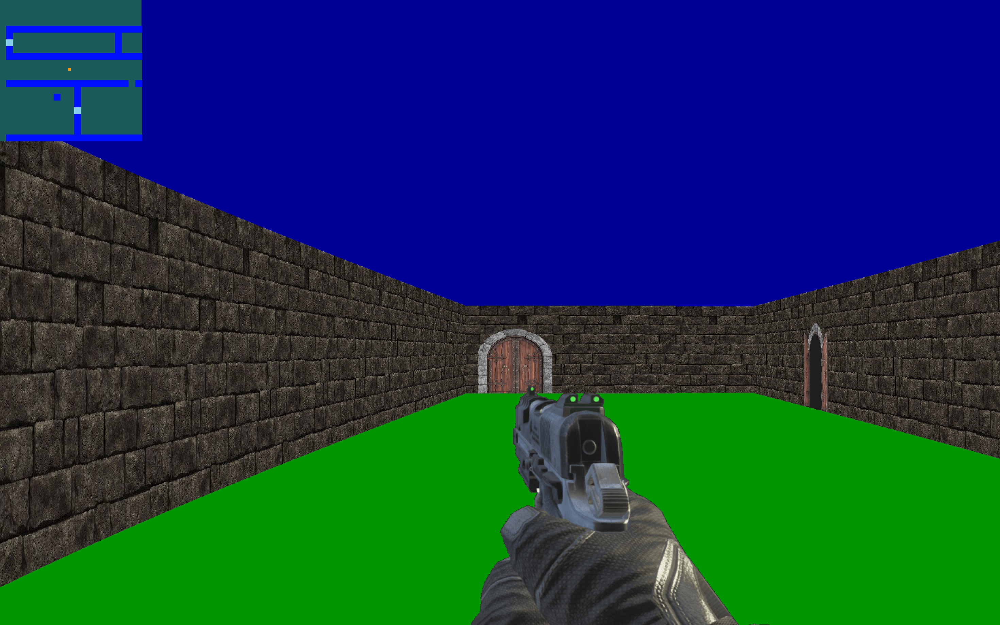

# Cub3D - 42 School Project

 <!-- Add actual gameplay screenshot here -->

Cub3D is a team project developed as part of the 42 School curriculum, implementing a raycasting engine inspired by the classic *Wolfenstein 3D*. This project demonstrates core concepts of 3D rendering using the MiniLibX graphics library, featuring dynamic first-person navigation in a textured maze environment.

**Archived State**: This repository reflects the project's state at its final evaluation.

---

## Features

### Mandatory
- Raycasting-based 3D rendering engine
- Basic player movement (forward/backward, strafing)
- Keyboard-controlled camera rotation
- Map validation system
- Wall/sprite texture management

### Bonus
- Wall collision detection
- Interactive minimap overlay
- Mouse-controlled camera rotation
- Enhanced input handling

---

## Installation

### Prerequisites
- MiniLibX library (included as submodule)
- X11/Wayland development libraries (Linux)
- macOS or Linux environment

```bash
# Clone repository with submodules
git clone --recurse-submodules https://github.com/aymane-hamdi/cub3D.git
cd cub3D
```
---

# Compilation & Execution

## Build Instructions

```bash
make 

```

## Running the Program 

```bash
./cub3D maps/map.cub
```
---

## Controls

| Action                  | Key/Mouse          |
|-------------------------|--------------------|
| Movement                | W/A/S/D            |
| Camera Rotation         | ← / → Arrow Keys   |
| Close/ Open door        | c/o                |
| Mouse Rotation          | Mouse Movement     |
| Exit                    | ESC                |

---
# Technical Resources

# Useful Resources for This Project

## 1. MiniLibX:
   - [MiniLibX Documentation ](https://harm-smits.github.io/42docs/libs/minilibx/getting_started.html)

## 2. Xlib (for MLX events):
   - [Xlib Manual](https://tronche.com/gui/x/xlib/)

## 3. Raycasting:
   - https://lodev.org/cgtutor/raycasting.html
---

# Contributors
Kheireddine Anas

GitHub: @Kheireddine-Anas

Aymane Hamdi

GitHub: @aymane-hamdi


